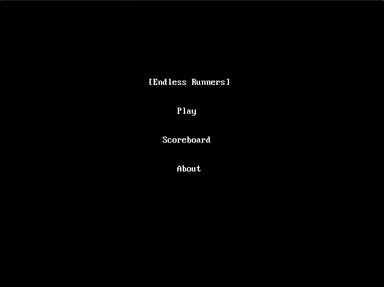
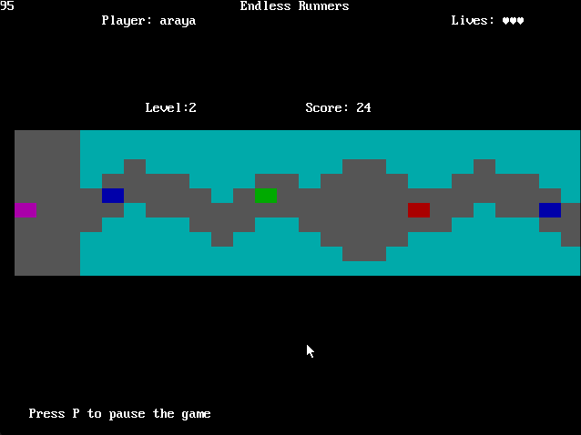
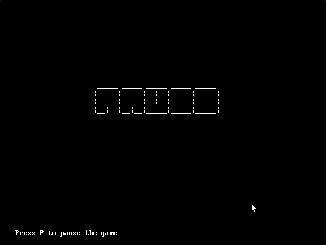
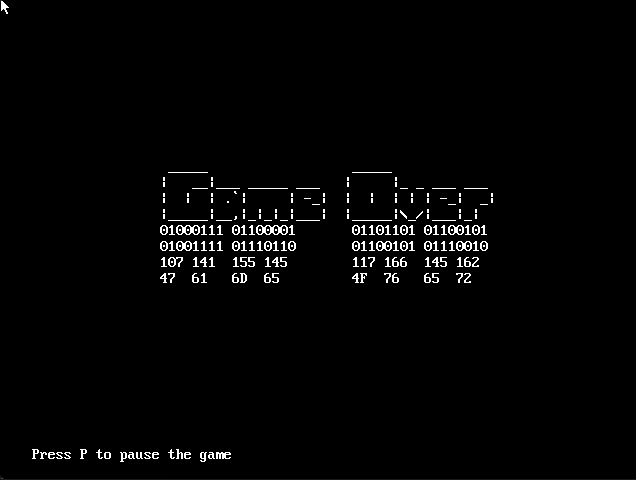

# proyecto-ii-arquitectura-de-computadores-2023

 ```
  _____       _ _                _____                         
|   __|___ _| | |___ ___ ___   | __  |_ _ ___ ___ ___ ___ ___ 
|   __|   | . | | -_|_ -|_ -|  |    -| | |   |   | -_|  _|_ -|
|_____|_|_|___|_|___|___|___|  |__|__|___|_|_|_|_|___|_| |___|
 ```                                                             
## Main Title


## In Game


## Pause


## Game Over


## How to build the executable
Launch a MS-DOS console and type the following command:
```powershell
EXECUTE.BAT
```
