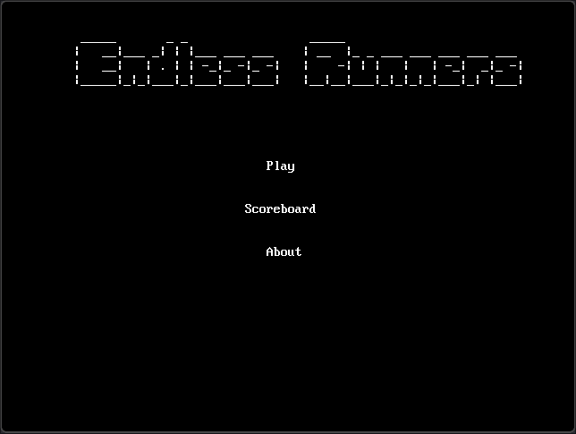
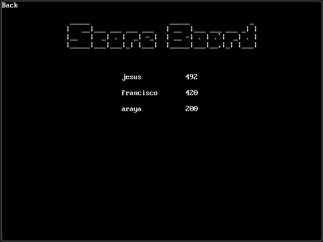
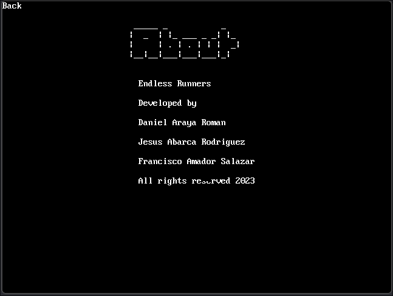
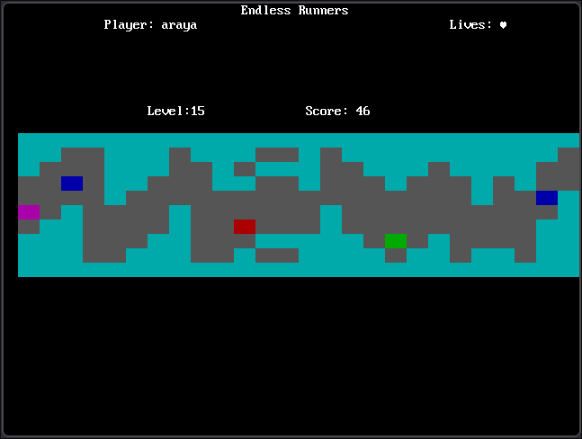
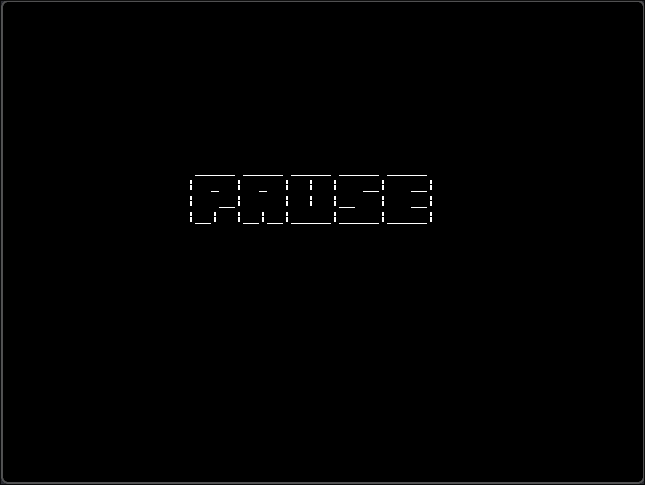
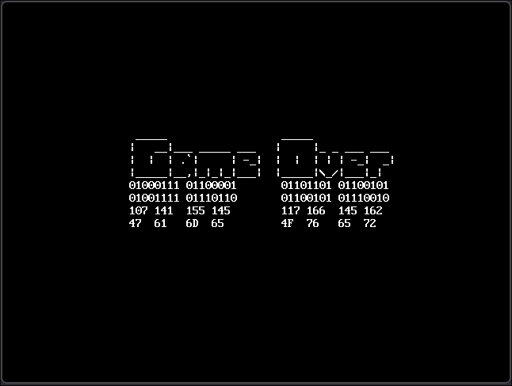

# proyecto-ii-arquitectura-de-computadores-2023

Welcome to our thrilling 2D Endless Runner, meticulously crafted in TASM for MS-DOS. Immerse yourself in the excitement of randomly generated scenarios, challenging obstacles, and an ever-changing landscape.

Navigate through a dynamic world where each run is a unique experience. Test your reflexes by dodging, jumping, and weaving through obstacles. Discover strategically placed power-ups that not only boost your score but also enhance your overall gameplay.

**Features:**

- **Random Scenarios:** Experience a dynamic world with uniquely generated scenarios.
  
- **Challenging Obstacles:** Test your reflexes at every turn as you navigate through an ever-changing landscape.

- **Strategically Placed Power-ups:** Discover items strategically placed to enhance your gameplay and boost your score.

- **Scoreboard Table:** Track your progress, compete against yourself, and challenge friends to beat your high score.

- **Progressive Levels:** As you advance through levels, the game introduces new elements, keeping the adventure fresh and engaging.

**Gameplay:**

Navigate through obstacles by moving **up** and **down** using the arrow keys or **w** and **s**. The game's progressive levels ensure that the excitement never wanes, providing a constantly evolving experience.

**Score and Compete:**

Track your progress on the scoreboard table and challenge friends to beat your high score. Can you become the ultimate Endless Runner champion?

Download the game executable, run it on your MS-DOS system, and embark on a non-stop adventure filled with challenges and excitement. Get ready to test your skills and see how far you can go in this classic Endless Runner!

## Game Snapshots

### Main Title


### Score Board


### About


### In Game


### Pause


### Game Over


### How to build the executable
Launch a MS-DOS console and type the following command:
```powershell
EXECUTE.BAT
```
